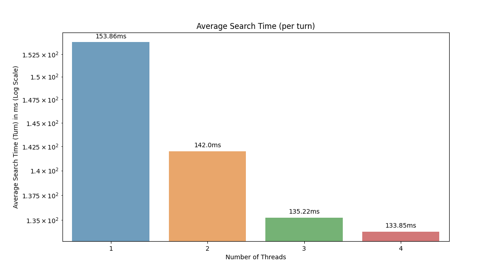

# Connect Four Genetic Search Algorithm

## Table of Contents
- [Introduction](#introduction)
- [Motivation](#motivation)
- [Features](#features)
- [User Interface](#user-interface)
- [Console Interface](#console-interface)
- [Testing and Quality Assurance](#testing-and-quality-assurance)
- [Getting Started](#getting-started)
- [Contributing](#contributing)
- [License](#license)

## Introduction

In the realm of computer science and parallel computing, the challenge of optimizing Genetic Search Algorithm (GSA) has always intrigued us. This project delves into the world of parallelization to tackle the Connect Four game using a Genetic Search Algorithm. Connect Four is a classic two-player game where the objective is to align four discs of the same color in a grid. In this project, one player is a human user, while the other is a computer opponent.

The primary goal of this project is to implement and parallelize a Genetic Search Algorithm to make the computer opponent more challenging. This involves finding the best possible next move for the computer player based on the current state of the game board. The parallelization efforts encompass both CPU and GPU-based optimizations to efficiently calculate fitness values for potential moves.

This exercise leverages the power of the C programming language, utilizing libraries such as Raylib and Raylibgui to create a graphical interface for the game. This interface provides users with the flexibility to fine-tune the parameters of the Genetic Search Algorithm, including the crossover rate, population size, mutation rate, maximum generations, and maximum moves. Users can also customize the game board size and select the first player.

Additionally, this project offers versatility by allowing execution from the console with various arguments, making it adaptable to different scenarios and usage patterns. The project is well-documented and hosted on GitLab, providing a structured development environment.

## Motivation

The motivation behind this exercise is to explore the parallelization techniques and optimizations necessary to enhance the performance of GSA. By harnessing the power of both CPU and GPU parallelization, we aim to create a fast-responding computer opponent for Connect Four, making the game more challenging and exciting for players. This exercise not only enhances our understanding of parallel computing and GSA but also demonstrates its practical application.

The decision to implement a genetic search algorithm to solve Connect Four is motivated by several compelling factors. A Classic Connect Four game board consists of 7 columns and 6 rows, totaling 42 squares. The time complexity of the Minimax algorithm is O(bd), where b is the branching factor (7), and d is the depth of the game tree (the depth of the game tree can, at the outset, reach a maximum of 42). This implies that conventional search algorithms face significant challenges in the context of Connect Four, especially with a larger game board (growth in branching factor and depth).

While techniques like Alpha-Beta pruning and transposition tables can be employed to optimize the Minimax algorithm, they encounter limitations when dealing with games like Connect Four. The high branching factor and substantial search depth demand additional approaches for efficient solution finding.

The implementation of a genetic search algorithm provides a fascinating alternative. This algorithm relies on evolutionary principles, allowing for the creative development and improvement of game strategies. Genetic search utilizes populations of game strategies and continuously adapts them to discover optimal solutions.

The choice of a genetic search algorithm presents an interesting challenge that extends the application of genetic and evolutionary algorithm principles to the field of game AI. This not only broadens our horizons regarding algorithm application but also makes the work more exciting and creative.

Overall, the implementation of a genetic search algorithm offers an exciting opportunity to elevate the level of play in Connect Four by significantly enhancing the computer opponent’s gameplay skills while showcasing the limitations of conventional search algorithms in challenging game scenarios.

## Features

### User Interface

A user interface is provided to allow users to interact with the Genetic Search Algorithm. The interface is built using Raylib and RaylibGui, providing a simple and intuitive experience for users. The interface allows users to customize the game board size, select the first player, switch between multiple different styles, and shows the basic controls. The interface also allows users to fine-tune the parameters of the Genetic Search Algorithm, including the crossover rate, population size, mutation rate, maximum generations, and maximum moves.

### Console Interface

A console interface is provided to allow users to interact with the Genetic Search Algorithm. The interface allows users to fine-tune the parameters of the Genetic Search Algorithm, including the crossover rate, population size, mutation rate, maximum generations, and maximum moves. The console interface also allows users to customize the game board size and select the first player.

#### Argument Description

- `-h`, `--help`: Display help and usage information for the application.
- `-b`, `--benchmark`: Run benchmark tests to evaluate the performance of the application.
- `-v`, `--version`: Display the version information of the application.
- `-r`, `--rows`: Specify the number of rows for the game board.
- `-c`, `--cols`: Specify the number of columns for the game board.
- `-m`, `--maxMoves`: Set the maximum number of moves allowed in the game.
- `-p`, `--populationSize`: Define the population size for the Genetic Search Algorithm.
- `-x`, `--crossoverRate`: Set the crossover rate for the Genetic Search Algorithm.
- `-u`, `--mutationRate`: Set the mutation rate for the Genetic Search Algorithm.
- `-g`, `--maxGenerations`: Define the maximum number of generations for the Genetic Search Algorithm.

## Testing and Quality Assurance

All core components of the project are unit-tested using the library Munit. The unit-tests are executed using the Gitlab CI/CD pipeline. The program was also tested using Valgrind to detect memory leaks and errors. All invalid reads and writes reported by Valgrind were fixed with the exception of warnings regarding the Raylib library as they are out of the scope of this project.

## Getting Started

To get started with this project, follow these steps:

1. Clone the repository from GitLab.
2. Install the required dependencies (raylib and raylib-gui).
3. Build the project using: `make build`.
4. Run the program with the desired configuration.

## Results

